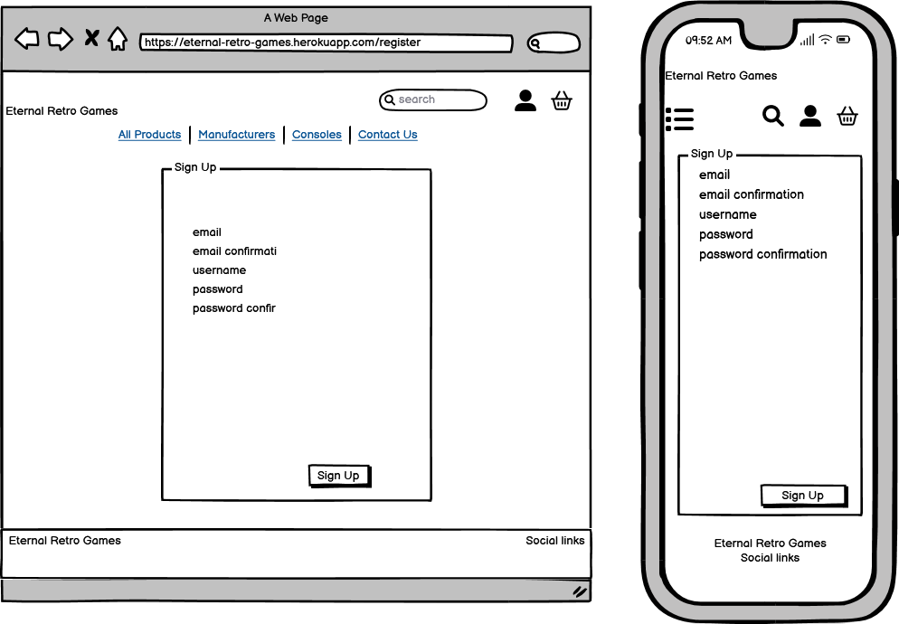

# Eternal Retro Games


Eternal Retro Game is my first full stack website built using Django, Python, HTML, CSS and JQuery. This is e-commerce site that was inspired by a passion for keeping gaming, in particular retro gaming, where the user can shop for nostalgic relics of the very loaved industry. This website utilises Stripe payment provider.

This project was created as part of my fourth and final project for my Level 5 Diploma in Web Application Development. This course was provided by Code Insitute.
The site uses the walkthrough Boutique Ado as part of a template layout but have added some of my code and logic as well as other code snippets adjusted for my needs. Any other code that was used is either credited or mentioned in the credits.
---

[View the live website deployed on Heroku](https://eternal-retro-games.herokuapp.com/)

---
## Contents

* [User Experience](#user-experience)
  * [Strategy](#strategy)
    * [Project Goals](#project-goals)
  * [Scope](#scope)
    * [Feature Planning](#feature-planning)
  * [Structure Plane](#structure-plane)
    * [User Stories](#user-stories)
  * [Skeleton Plane](#skeleton-plane)
    * [Wireframes](#wireframes)
  * [Surface Plane](#surface-plane)
    * [Colour Scheme](#colour-scheme)
    * [Typography](#typography)
    * [Imagery](#imagery)
* [Features](#features)
  * [General Features of The Site](#general-features-of-of-the-site)
  * [Future Implementations](#future-implementations)
* [Technologies Used](#technologies-used)
  * [Languages Used](#languages-used)
  * [Database Used](#database-used)
  * [Frameworks Used](#frameworks-used)
  * [Libraries & Packages Used](#libraries--packages-used)
  * [Programs Used](#programs-used)
  * [Stripe](#stripe)
* [Deployment & Local Development](#deployment--local-development)
  * [Deployment](#deployment)
    * [Environment Variables](#environment-variable)
    * [Heroku Deployment](#heroku-deployment)
      * [Heroku Variables](#heroku-variables)
      * [Deployment Extra](#deployment-extra)
      * [Setup to auto-deploy when pushed to GitHub](#setup-to-auto-deploy-when-pushed-to-gitHub)
    * [Amazon Web Services (AWS) Setup](#amazon-web-services-(aws)-setup)
    * [Create s3 bucket](#create-s3-bucket)
    * [Create access policy group and user](#create-access-policy-group-and-user)
      * [Create Group and Policy](#create-group-and-policy)
      * [Attach policy to group](#attach-policy-to-group)
      * [Create User and add to group](#create-user-and-to-group)
      * [Connect Django to AWS s3 bucket](#connect-django-to-aws-s3-bucket)
      * [Add media files to s3 bucket](#add-media-files-to-s3-bucket)
    * [Stripe Setup](#stripe-Setup)
      * [Create new webhook end point](#create-new-webhook-end-point)
    * [Email Setup](#email-setup)
  * [Local Development](#local-development)
    * [How to Fork](#how-to-fork)
    * [How to Clone](#how-to-clone)
* [Testing](#testing)
* [Credits](#credits)
  * [Content](#content)
  * [Media](#media)
  * [Acknowledgments](#acknowledgments)
* [Additonal Comment](#additional-comments)

---

responsive site image here

---

## User Experience

### Strategy

#### **Project Goals**

Eternal Retro Games is an e-commerce site created for my final project with Code Institute.The site is purely educational purposes.

The sites main goal is to reach out to collectors of retrospective and current generation video games.It currently will cater for the top 4 (Sony, Sega, Nintendo and Microsoft) console and games manufacturers from the last 3 decades. Shoppers should be able to easily navigate through the site and be able to search for a particular game.

Further goals:
* To enable site admin to maintain and update the site content as needed
* To provide an ecommerce solution to bring the stores products to consumers - Business 2 Consumer
* To provide users with a varied product selection from a a few manaufacters and a smooth purchase experience.
* To provide users with a place to safe checkout process using a payemtn gateway - Stripe.

\
&nbsp;
[Back to Top](#contents)
\
&nbsp;


### Scope

#### **Feature Planning**
##### Current Features

* User roles
* Sign up for an account
* Account Profile - Can only be set by Superuser in admin
* Password recovery - Allauth
* Seach and filter through products
* Guest Checkout
* Checkout system - Logge users
* Payment Via Stripe
* Receive email confirmation for order
* Order History
* Admin - add product
* Admin - edit/update product
* Admin - delete product
* Terms and Conditions
* Privacy Policy
* Social Media Links

#### Future Features
* Admin - Stock managment
* Wishlist
* Product Reviews
* Use social media to sign up/log in
* Delivery Terms
* Use actual gaming logos and images instead of the buttons for search/filter

\
&nbsp;
[Back to Top](#contents)
\
&nbsp;


### Structure Plane

#### User Stories
| ID  | As A/An    | I want to...                                                      | So I can...                                                                           |
| --- | ---------- | ----------------------------------------------------------------- | ------------------------------------------------------------------------------------- |
|**_Viewing and Navigation_**     |||                                                                                       |
| 1   | Customer | View list of all products                                             | Find something to purchase  |
| 2   | Customer | View products details                                           | See Price, Description, Image, developer and Ratings  |
| 3   | Customer | View carts total at all times                                   | Avoids overspending and can easily stick to a budget |
|**_Registration and User Accounts_**      | | |                                                                                       |
| 4   | Reg User | Register for an account                                           | Save my delivery information and order history                                            |
| 5   | Reg User | Quickly login/out                                                 | Access my account  |
| 6   | Reg User | Request a password reset                                          | Receive an email to reset my password  |
| 7  | Reg User | Access my user profile                                            | View my order history, manage my personal details |
| **_Sorting and Searching_**           |  |    |    |
| 8   | Customer | Sort the list of all available products                               | See the products in a list sorted by price, rating, quantity available etc |
| 9  | Customer | Sort products by manufacturer or platform                                       | See the products sorted by name, price, rating, etc|
| 10  | Customer | Filter products by manufacturer                           | See the products by manufacturer or platform |
| 11  | Customer | Search for product                                                | Find a specific item by a simple search  |
| 12  | Customer | View a list of search results                                     | return a list of products if available  |
| **_Purchasing and Checkout_**    |  |  | |
| 13  | Customer | View items in my shopping cart                                           | See what items are in the cart |
| 14  | Customer | Adjust the quantity of individual items in the cart                 | quickly adjust the amount of any item I added and be able to remove  |
| 15  | Customer | Easily enter my payment information                               | Checkout quicklywith or without being logged in |
| 16  | Customer | Be confident on the payment system being used                | secure provide personal information, and feel safe doing this |
| 17  | Customer | View  order summary before completing purchase             | Verify I haven't made any mistakes                                                    |
| 18  | Customer | Receive confirmation email after checking out                     | To keep my own record of the purchase                                                 |
| **_Admin and Store Management_**     || ||
| 19  | Staff  | Add a product                                                     | Add new products to my store                                                          |
| 20  | Staff | Edit/update a product                                             | Change the price, description, images etc of a product                                |
| 21  | Staff | Delete a product                                                  | Remove items that aren't for sale anymore |
| 22  | Superuser | delete users and set profile permission                       | Remove user and also be able to update users profiles |


\
&nbsp;
[Back to Top](#contents)
\
&nbsp;


### Skeleton Plane

#### **Wireframes**

I used the  [Balsamiq](https://balsamiq.com/) to create the wireframes of the final desired look of the site.

* Base Template - This is a basic layout view that contains the Header and fotter. All navigation is on this this template and all other pages will be placed within the main section of the base template. This is all donne using Django and builtin templates language.

  

* Home Page - Simple view with minimal text to almost guide the user to the view products button to start shopping

  

* Register Page - The register page allows new users to register for an account by registering for an account with a username/email.

  The username/email path will require users to choose a username, a password which will be entered twice to confirm the user hasn't made an error when entering the password and their email address, which again will be required to be entered twice to confirm there are no mistakes in the users input.

  

* Login Page - The login page will allow users to sign into their account with either their username or email.

  

* Logout Page - The logout page confirms that the user to confirm wants to logout. On confirming, the user will be logged out of their account, cart cleared and redirected to the home page.

  

* Profile Page - The profile page displays a users default delivery information and previous order history, They can view these order and update their information Including adding a First name and Surname for quicker checkout.

  

* Cart Page with items - When a user has added items to their cart, The product information will be shown as well as quantity, value and grand total There will be a secure checkout button and continue shooping button as well. The can adjust and delete products from this view as well.

  

* Cart page - Empty - The cat page will display a message stating the cart is empty and have a button directing them to the products.

  
  
* Checkout Page - The checkout page has a form for the user to fill in their name, contact number, email address and delivery address. They also have an option to save these details to their profile once the order is placed. On returning clients this will prepoplulate with the information saved on their profile.

     Under the form, there is the Stripe payment section where the user can enter the card details.

  The user will also be shown a summary of the products they are purchasing. This consists of an image of the product, the title of the product, a size if applicable, the quantity they are purchasing and the subtotal for that product. Underneath the summary are the subtotal, delivery costs and grand total.

  

* Payment Processing Overlay - On submitting the payment, the user will see a payment overlay with a credit card flipping so they feel and can see that this payment is being processed. The overlay does not do anything more than be a visual cue that payemnt is being submitted but in reality has no functionality. Once payment has been processed, the user will be directed to the checkout success page with a summary of the order.

  

* Checkout Success -

  

* Products - client/guest - the products are displayed in borderless cards that will automatically resize to the diffrent view ports.

  

* Product Detail - the product details page is displayed in borderless cards that will automatically resize to the diffrent view ports, This view has the title, price, platform, summary and rating for that product.you can adjust the quantity you wish to purchase and there are 2 buttons, Keep Shopping and Add to cart

  

* Edit Product - The Edit product page is only accessible to admin/superuser users. It displays a prepopluated form, with the information about the product they are editing.

  

* Delete Product - The Delete product page is only accessible to admin/superuser users. On clicking there will be a modal asking the user if they want to delete this product and warning them that it cannot be undone.

  

* Toasts - Toasts are used to provide quick informaive messages of actions taken by a user. If a product is added to the cart, a successful toast will apprear diaply it has been added with a summry of the cart.
* There are 4 categories of toast:
    * Successful
    * Warning
    * Error
    * Info

  


  \
&nbsp;
[Back to Top](#contents)
\
&nbsp;


### Surface Plane

#### **Colour Scheme**

I have used the following colours:

I have used colours that I matched on Coolors as well as pattern trends. Main site used the cool blue but for the main products, checkout, and cart i have decided to keep it white.


#### **Typography**

I have used the default font from Django.


\
&nbsp;
[Back to Top](#contents)
\
&nbsp;


#### **Imagery**

Images are kept to the product images.

There is a home page image on arrival but everything else follows a clean minimilist style to is. Mainly to draw the user to the products.

---
## Features

### General Features of of the site

Each page of the site shares the following:

* Favicon
* Navbar
* Footer

site pages images


\
&nbsp;
[Back to Top](#contents)
\
&nbsp;


### Future Implementations

In future implementations I would like to:

---

\
&nbsp;
[Back to Top](#contents)
\
&nbsp;

---
## Technologies Used

### Languages Used

HTML, CSS, JavaScript, Python

### Database Used

sqlite3 for development - default with Django

[ElephantSQL](https://www.elephantsql.com/) for deployment.

### Frameworks Used

[Django](https://www.djangoproject.com/) - Version 4.1.3 -

[Bootstrap](https://getbootstrap.com/docs/4.6/getting-started/introduction/) - Version 5.2.3.

### Libraries & Packages Used

[Django Allauth](https://django-allauth.readthedocs.io/en/latest/) - Version 0.51.0 - Used for authentication, registration & account management.

[jQuery](https://jquery.com/) Version 3.6.2.

[Font Awesome](https://fontawesome.com/) - Version 6.2.1 - Used for the iconography of the site, this was added using a CDN link.

### Programs Used

[Am I Responsive](https://ui.dev/amiresponsive) - To create the responsive images of the site on a variety of device sizes.

[Balsamiq](https://balsamiq.com/) - Used to create wireframes.

[Favicon.io](https://favicon.io/) - To create the favicon from the png downloaded from [Icons8](https://icons8.com/)

[Git](https://git-scm.com/) - For version control.

[GitHub](https://github.com/) - To save and store the files for this project.

[Google Dev Tools](https://developer.chrome.com/docs/devtools/) - To troubleshoot, test features and solve issues with responsiveness and styling.

[Firefox Dev Tools](https://firefox-source-docs.mozilla.org/devtools-user/index.html) - To troubleshoot, test features and solve issues with responsiveness and styling.

[Microsoft Edge Dev Tools](https://learn.microsoft.com/en-us/microsoft-edge/devtools-guide-chromium/landing/) - To troubleshoot, test features and solve issues with responsiveness and styling.

[Pip](https://pypi.org/project/pip/) - A tool for installing Python packages.

[Pipenv](https://pipenv.pypa.io/en/latest/index.html) - Pipenv is a tool that aims to bring the best of all packaging worlds (bundler, composer, npm, cargo, yarn, etc.) to the Python world.

[Tiny PNG](https://tinypng.com/) - To compress images used in the README.

### Stripe

[Stripe](https://stripe.com/gb) has been used in the project to implement the payment system.

---

\
&nbsp;
[Back to Top](#contents)
\
&nbsp;


---
## Deployment & Local Development

### Environment Variables
The following environment variables (in CAPS) must be set within your development environment for the site to function correctly.  These are listed and described below and instructions to obtain these are featured in the following sections.

* DEVELOPMENT
  * Required so that within the development environment, debug = True.
  * *Value: set as **True*** 
* SECRET_KEY
  * Required by Django: A random sequence of characters used to maintain security.  
  * *Value: Django secret key.  A good resource is [miniwebtool – django secret key  generator](https://miniwebtool.com/django-secret-key-generator/) and should be different to the same variable in the Heroku app.*
* STRIPE_PUBLIC_KEY 
  * *Value: from stripe account (see below section [Stripe Setup](#Stripe-Setup))*
* STRIPE_SECRET_KEY
  * *Value: from stripe account (see below section [Stripe Setup](#Stripe-Setup))*
* STRIPE_WH_SECRET
  * *Value: from stripe webhook endpoint (see below section [Create webhook](#Create-new-webhook-end-point)).*  Note that this is different to the one set for Heroku (see below section ?).  

Database migrations will need to be made by following the below commands:
```
  python manage.py migrate --plan*
  python manage.py migrate
```
The 'makemigrations' command will not need to be run here before the 'migrate' command as all the migration files are within the repository.  Should further changes to the models be made however the below commands will need to be run prior to running migrate:
```
  python manage.py makemigrations --dry-run*
  python manage.py makemigrations
```
*These commands do not have to be run, but it is best practice, so that the plan migrations can be viewed before completing them.


The project should then be push to your repository using the below commands:
```
  git add <name of file> or <.>
  git commit -m *<commit message>*
  git push
```

The application can now be run locally by typing in a terminal window:
```
  python manage.py runserver
```
Data can then be added to the site when signed in with the superuser credentials.

### Heroku Deployment

NB: If you are going to use gitpod as your editor please use python3 instead of python in the sections below. Also for users that are using virtual environments, please read their documentation for the .lock files and how to update them and get these updated when deplying to heroku.

#### Heroku Variables
The following environment variables (in CAPS) must be set within the ‘Config Vars’ section in Heroku for the deployed site to function correctly.   The config variables are added within the Heroku app by selecting the Settings tab, and under the heading 'Config Vars' clicking the button 'Reveal Config Vars' to show the key / value input boxes for the variables.  Instructions to obtain the variables are featured within below sections.

* SECRET_KEY
  * Required by Django: A random sequence of characters used to maintain security.  
  * *Value: Can use Django secret key generator (https://miniwebtool.com/django-secret-key-generator/) and should be different to the same variable in the development environment.*
* STRIPE_PUBLIC_KEY 
  * *Value: from stripe account (see below section [Stripe Setup](#Stripe-Setup))*
* STRIPE_SECRET_KEY
  * *Value: from stripe account (see below section [Stripe Setup](#Stripe-Setup))*
* STRIPE_WH_SECRET
  * *Value: from stripe webhook endpoint. Note that this is different to the one set for the development environment (see below section [Create webhook](#Create-new-webhook-end-point)).*  
* DATABASE_URL
  * *Value: automatically setup during Heroku deployment (can be obtained by viewing your Postgres database within the Heroku dashboard, under Settings Database Credentials).*
* USE_AWS
  * Required so that the deployed app uses AWS for images and static files.
  * *Value: set as **True***
* AWS_ACCESS_KEY_ID
  * Required for connection to the AWS s3 bucket
  * *Value: obtained within the downloaded .csv file generated during user creation in AWS (see below section [Create s3 bucket](#Create-s3-bucket)).*
* AWS_SECRET_ACCESS_KEY
  * Required for connection to the AWS s3 bucket
  * *Value: obtained within the downloaded .csv file generated during user creation in AWS (see below section [Create s3 bucket](#Create-s3-bucket)).*
* EMAIL_HOST_PASS
  * Required by Django to send emails using chosen email account
  * *Value: 16 character password provided by, in this instance; Gmail (see below section [Email Setup](#Email-Setup)).*
* EMAIL_HOST_USER
  * Required by Django to send emails using chosen email account
  * *Value: the email address of chosen email account (e.g. `john.smith@gmail.com`)*

#### Deployment Extra
In order to run properly, Heroku requires:
*	requirements.txt
*	Procfile

Both of these files should be within the cloned repository, so ensure these are pushed to your GitHub repository. 

To deploy the app to Heroku from the GitHub repository you will need to follow the below steps:
*	Go to [Heroku]( https://www.heroku.com/).
*	Log in and click on 'New' > 'create new app'.
*	Enter an App name -Must be unique.
*	Choose a region, then click ‘create app’.
* Within the new app select the ‘resources’ tab and under addons type in ‘postgres’ to provision a new Heroku Postgres database (this will also add the required DATABASE_URL variable and value in the Heroku Config variables)

#### Setup to auto-deploy when pushed to GitHub
* Within the Heroku web dashboard, Click on the Deploy tab.
* Select deployment method as ‘GitHub’, and then search for your repository below that.
* Once your repository name is returned, click 'connect'.
* Then click ‘enable automatic deploys’

Within the development environment, in a terminal window, login into Heroku by entering the below command and following the prompts.
```
  heroku login -i
```

Then type the below to setup a superuser: 
```
  heroku run python manage.py createsuperuser
```
Database migrations will need to be made to the Heroku postgres by following the below commands (you will need to be logged into Heroku to perform these):
```
  heroku run python manage.py migrate --plan*
  heroku run python manage.py migrate
```
*This command does not have to be run, but it is best practice, so that the planned migrations can be viewed before completing them.

Once all the configuration variables have been added, the deployed app can then be run from Heroku by selecting it and clicking 'open app'. 

### Amazon Web Services (AWS) Setup
### Create s3 bucket
* Go to [Amazon Web Services](https://aws.amazon.com/) and set up an account if you do not have one.
* Once logged in, under ‘my account’ select ‘AWS Management Console’ and search for the service ‘s3’
* Once in the s3 interface create a new bucket for this project.
* Name the bucket and select a region closest to you.
* Uncheck block all public access and acknowledge that the bucket will be public.
* Select ‘create bucket’ to finish and the bucket will be created.
* Under the bucket properties tab, select to ‘edit’ Static website hosting and select ‘enable’.
* Ensure that ‘host a static website’ is selected and enter a default value for index as this will not be used for this project deployment.
* Click save.
* Next click permissions tab and select to edit the CORS 
* Enter and save the below cors configuration which will set up the required access between the Heroku app and this s3 bucket.
```
[
  {
      "AllowedHeaders": [
          "Authorization"
      ],
      "AllowedMethods": [
          "GET"
      ],
      "AllowedOrigins": [
          "*"
      ],
      "ExposeHeaders": []
  }
]
```
* Next select to edit the bucket policy and select ‘policy generator’ to generate a policy.  Before you do that, copy the ‘Bucket ARN’ (you will also need this for setting up a group within Identity and Access Management below).
* Within the policy generator select policy type of ‘S3 Bucket Policy’
* Within Add Statements, select ‘allow’ for effect and type a star within ‘Principal’:  
* For Actions select only ‘GetObject’:  
* Then below that paste in the ‘bucket ARN into the Amazon Resource Name input box.
* Click ‘Add Statement’, then ‘Generate Policy’
* Copy the policy into the bucket policy editor and then so as to allow access to all resources in this bucket, add a slash star onto the end of the resource key:
* Click Save.
* Next select to edit the Access control list and set the list objects permission for everyone under the Public Access section as below:  
 
### Create access policy group and user
#### Create Group and Policy
* Within the AWS services menu open Iam (Identity and Access Management) and in the left hand menu click ‘User groups’ to create a new group.
* Name a new group and click ‘create group’.
* Click ‘policies’ so as to create a policy used to access the new bucket.
* Click ‘create policy’ and then select the ‘JSON’ tab and select ‘import managed policy’.
* Within the search input, search for s3 and then select to import the Amazon s3 full access policy.  
* Modify the policy by entering the ARN from the bucket policy in s3 as the value for resource.
* Click ‘Next: Tags’ and then click ‘Next: Review’
* Provide a name and description for the policy and click ‘Create policy’.

#### Attach policy to group
* Within the AWS services menu open Iam and in the left hand menu click ‘User groups’ to view the newly created group.
* Select the new group and click on the permissions tab
* Click the ‘Add permissions’ button and select ‘Attach Policies’ from the drop down.
* Select the policy that was just created, by checking the tick box and click on ‘Add permissions’

#### Create User and to group
* Within the AWS services menu open Iam and in the left hand menu click ‘Users’ and then select ‘Add users’
* Provide a name for the user, check the tick box to grant the user access and select next.
* Check the tick box next to the group just created to add the user to the group.  Click through the next few pages to create user.
* **!IMPORTANT:** On the success page, click 'Download .csv file' which contains the user access key and secret access key needed to authenticate them from the Django app.

### Connect Django to AWS s3 bucket
Within the Django app settings python file enter the name and region name for the AWS s3 bucket that you have set up.

Within Heroku add the AWS_ACCESS_KEY_ID and AWS_SECRET_ACCESS_KEY to the config variables and also add a USE_AWS key and set it to true.  The access key and secret key are contained with the **downloaded csv file**.

Once that is done, git add, commit and push the changes which will trigger a deployment to Heroku.  Check the Heroku build log to check that the static files were collected and there should be a 'static' folder within the s3 bucket. 

### Add media files to s3 bucket
The below instructions detail how to do this within the s3 management interface.

* Within the s3 bucket overview click create folder and call it media.
* Inside that folder click on ‘upload’ and then ‘add files’
* Select all of the product images (found within the repo download performed earlier) and click open
* Click next and then under permissions, check the box for ‘grant public-read access’.
* Then click upload.
* There should now be a 'media' folder within the s3 bucket containing the images.

---
## Stripe Setup
* Create a [Stripe](https://stripe.com) account or log in to existing.
* On the Stripe dashboard, under ‘Developers’ copy the ‘test API key’ and ‘ Secret key’.  Use these as the values for the environment and Heroku variables STRIPE_PUBLIC_KEY and STRIPE_SECRET_KEY as detailed above. 

### Create new webhook end point
**NOTE:** Two separate webhooks will need to be setup. One for the development environment and one for the Heroku app.
* Run the application to get the address of the site.  Copy this and go to the Stripe dashboard.
* Click ‘Developers’, select ‘webhooks’ and then click ‘Add endpoint’.
* Paste in the site URL and add to the end ‘/checkout/wh/’.
* Click ‘Select Events’ and select the events such as:
```
  ‘payment_intent_suceeded’ 
  ‘payment_intent_failed’
```
* In the newly created webhook endpoint details the ‘signing secret’ is now available.  Copy this and add it to the value for the environment and Heroku variable STRIPE_WH_SECRET as detailed above.
* Within the Stripe dashboard for that webhook, click ‘send test webhook’ and verify that it is working.

The STRIPE_CURRENCY variable is defined within the Django app 'settings' python file and is set to currency needed (eg:'gbp' or 'usd'. See this link for [supported currencies](https://stripe.com/docs/currencies#presentment-currencies)

---
## Email Setup
The below instructions cover the setup using a [Gmail](https://google.com) account. This can be done with other accounts but this is the setup used:

* Log in to your email account or set one up.
* Click account settings, and select the 'Accounts and Import' option from the top selection
* Under ‘Change account settings’ click ‘Other Google Account settings’
* Click on the ‘security’ option on the left and then under ‘Signing in to Google’ click on ‘2-Step Verification’
* Click ‘get started’, enter password and then work through the verification.
* Once verification is done and 2-Step verification is turned on, a new option now shows under the previous ‘Signing in to Google’ menu screen.
* In this, on the App passwords screen, select from the dropdowns; ‘mail’ for app and ‘other’ for device.  Add an appropriate name and click ‘generate’.
* You will then be given a 16 character password which you will need to copy.

### In Heroku.
Add the 16 character password as the value to the variable ‘EMAIL_HOST_PASS’ to the Heroku Config variables.  Add another variable called ‘EMAIL_HOST_USER’ and set the value as the gmail account email used.

---

\
&nbsp;
[Back to Top](#contents)
\
&nbsp;


### Local Development

#### **How to Fork**

To fork the repository:

1. Log in (or sign up) to GitHub.

2. Go to the repository for this project, [eternal-retro-games](https://github.com/Daferia/Eternal-Retro-Games).

3. Click on the fork button in the top right of the page.

#### **How to Clone**

To clone the repository:

1. Log in (or sign up) to GitHub.

2. Go to the repository for this project, [eternal-retro-games](https://github.com/Daferia/Eternal-Retro-Games).

3. Click the Code button, select whether you would like to clone with HTTPS, SSH or the GitHub CLI and copy the link given.

4. Open the terminal in your chosen IDE and change the current working directory to the location you would like to use for the cloned repository.

5. Type the following command into the terminal `git clone` followed by the link you copied in step 3.

6. Set up a virtual environment (this step is not required if you are using the Code Institute template and have opened the repository in GitPod as this will have been set up for you).

7. Install the packages from the requirements.txt file by running the following command in the terminal:

```bash
pip install -r requirements.txt
```
Please follow the pipenv docs [Pipenv](https://pipenv.pypa.io/en/latest/index.html) should you want to use it as your virtual environment.

\
&nbsp;
[Back to Top](#contents)
\
&nbsp;

---
## Testing
Please refer to the [TESTING.md](TESTING.md) file for all testing performed.

---

## Credits
[Chelsea-Designs](https://github.com/chelsea-designs) - Used the deployment section as a template as it was throrough and easy to follow.
[Kera Cudmore](https://github.com/kera-cudmore) - fantastic README template. Have asked for permission to use README's due to the great structure
[Chris Zielinski](https://www.github.com/ckz8780/) - Used Boutique Ado walkthrough as template for my. site
### Content
[Kaggle](https://www.kaggle.com/) [TRUNG HOANG - Video Game Dataset](https://www.kaggle.com/datasets/jummyegg/rawg-game-dataset?resource=download) Dataset contains 474417 video games on over 50 platforms including mobiles. I only used part of this part due to the size of the dataset.
### Media
[The Old Computer](https://www.theoldcomputer.com/game-box-art-covers/) - Gaming images sourced from The Old Computer
[unsplash](https://unsplash.com/@derekstory) - Home image
[Arcade Artwork](https://www.arcadeartwork.org/index.php?/category/413/start-496#top) - Game cover artwork

### Acknowledgments

I would like to acknowledge the following people who have helped me with completing this project:
[Simen Daehlin](https://github.com/Eventyret) - Code Institute Mentor. 
[Rhys Davies](https://github.com/RD4899) - Work Mentor
[Ethan Morgan](https://github.com/gweithio) - Work Mentor

---
## Additional Comments


---

\
&nbsp;
[Back to Top](#contents)
\
&nbsp;