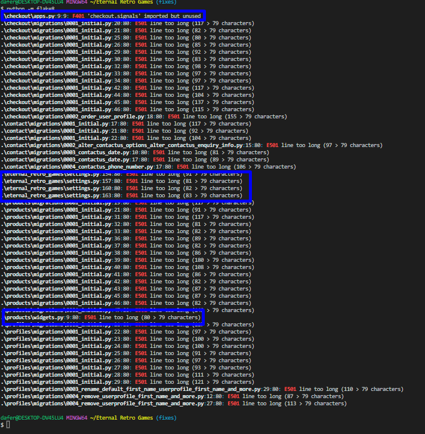
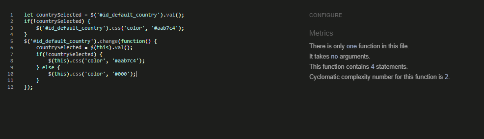
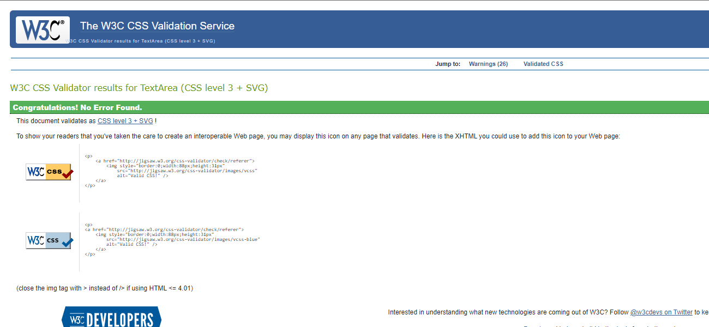

# Test Cases and Execution Report

To navigate back to the main README click [here](README.md)

## Validators

### Python Validation
Originally i used the CI Python Linter to check my code. I corrected the issues but after pushing the code, things landed up breaking. I remembered using flake8 on the last project so installed that and reran the tests. No errors were reported excepted for the widget,py line being too long. I tried breaking the line but no matter what i tried it would either break the code or throw and error. I opted to leave it as it was due to the code working. I also did not break the lines on the SETTINGS.py file as after looking it up it was suggested to leave those as is. I also had an issue with flake8 saying checkout.signals was not used but after going back to the walkthrough project i decided to leave it in. These are highlighted in the image below:

* Screenshots of the validator report:
	* 

* I have included these as well but will leave it in the folder should someone wnat to view it [here](static/documentation/images/python_validation). They are the files with pep8 in the name which were all from using the CI Python Linter.

### JavaScript Validation
The JavaScript code was checked using the jshint.com validator available at [jshint.com](https://jshint.com/). No errors were detected within the files I created, however, the quantity-input-script from the Boutique Ado has some errors but not affecting the functionality.

* Screenshot of the validator report is available here:
    * JavaScript
        * 
        * 
        * 

### CSS Validation

+ I used the [W3C CSS Valdation Service - Jigsaw](https://jigsaw.w3.org/) for my css validation. Due to the bootstrap cdn I received hundreds of warnings. I landed ap pasting all the css in the text field and got the pass result.

* 

### HTML Validation
For the HTML Testing I used [W3C Markup Validation Service](https://validator.w3.org/). Due to the authentication I had to inspect source and paste the code into the text field as well. I did have an issue with the new-image notification having a duplicate id attribute but as it was not casuing errors per se, I decided to leave it as it caused no errors.

* Duplicate id atrribute due to the message that pops up letting the user know the image being uploaded.

* Duplicate id atrribute due to the message that pops up letting the user know the image being uploaded.

## Other tests
### Lighthouse Testing
Used Lighthouse on multiple browsers and while the score was relatively high on desktop, mobile seemed to fluctuate aroun 75-82 for performance. Looking at the details, bootstrap seemed to be the main problem. I tried a slim version but my toasts became inconsistent and chose to leave it as is.

## User Story Testing

I manually tested this on a desktop and mobile phone. These are my results:
### Viewing and Navigation
| ID  | As A/An    | I want to...                                                      | So I can...                                                                           | Pass |
| --- | ---------- | ----------------------------------------------------------------- | ------------------------------------------------------------------------------------- | --- |
|     |            | **_Viewing and Navigation_**                                      |                                                                                       |
| 1   | Customer   | View list of products                                             | Find something to purchase                                                            | Pass |
| 2   | Customer   | View details of product                                           | See Price, Description, Image, and Sizes i/a                                          | Pass |                                                |
| 3   | Customer   | See my bag's total at any time                                   | Avoid spending too much                                                               | Pass |

### Registration and User Accounts
| ID  | As A/An    | I want to...                                                      | So I can...                                                                           | Pass |
| --- | ---------- | ----------------------------------------------------------------- | ------------------------------------------------------------------------------------- | --- |
|     |            | **_Registration and User Accounts_**                              |                                                                                       |
| 4   | Reg User   | Register for an account                                           | Save my delivery details and order history                                            | Pass |
| 5   | Reg User   | Login/out                                                 | Access my account                                                                     | Pass |
| 6   | Reg User   | Request a password reset                                          | receive and email to reset my password in case I forget it                            | Pass |
| 7   | Reg User   | Receive an email to verify my registration                       | Verify my account was registered successfully                                         | Pass |
| 8   | Reg User   | Access my user profile                                            | View my order history, manage or update my personal details                                     | Pass |

### Sorting and Searching
| ID  | As A/An    | I want to...                                                      | So I can...                                                                           | Pass |
| --- | ---------- | ----------------------------------------------------------------- | ------------------------------------------------------------------------------------- | --- |
|     |            | **_Sorting and Searching_**                                       |                                                                                       |
| 9   | Customer   | Sort the list of all available products                               | See the products in a list sorted by a varied set or sort options  | Pass |
| 10  | Customer   | Sort a products by manufacturer or platform                           | See the products in a manufacturer or platform                     | [Pass |
| 11  | Customer   | Filter products by category                           | See the products in a specified category | Pass |
| 12  | Customer   | Search for product                             | Find a specific item or return nothing found    | Pass |
| 13  | Customer   | View a list of search results                                     | Search result need to return all products by searched term    | Pass |

### Purchasing and Checkout
| ID  | As A/An    | I want to...                                                      | So I can...                                                                           | Pass |
| --- | ---------- | ----------------------------------------------------------------- | ------------------------------------------------------------------------------------- | --- |
|     |            | **_Purchasing and Checkout_**                                     |                                                                                       |
| 14  | Customer   | Easily find a product     | Ensure I don't accidentally select the wrong product, quantity, or size               | Pass |
| 15  | Customer   | View items in my basket    | See what items are in my basket at a glance to ensure the items are correct           | Pass |
| 16  | Customer   | Adjust the quantity of individual items in the cart      | Easily adjust the amount of an item to purchase and have option to remove it together       | Pass |
| 17  | Customer   | Easily enter my payment information     | Checkout quickly and allow to save/update info for logged user or have option for get to create account or login    | Pass |
| 18  | Customer   | View order summary before completing purchase   | I can see if all products i wanted are in the cart at the correct quantities    | Pass |
| 19  | Customer   | Feel my payment and personal information is secure                | feel safe using the payment gateway    | Pass |
| 20  | Customer   | Receive confirmation email after checking out                     | as a receipt of purchase for the store purchase    | Pass |

### Admin and Store Management
| ID  | As A/An    | I want to...                                                      | So I can...                                                                           | Pass |
| --- | ---------- | ----------------------------------------------------------------- | ------------------------------------------------------------------------------------- | --- |
|     |            | **_Admin and Store Management_**                                  |                                                                                       |
| 21  | Staff      | Add a product                                                     | Add new products to the store         | Pass |
| 22  | Staff      | Edit/update a product                                             | Change the price, description, images etc of a product  | Pass |
| 23  | Staff      | Delete a product                                                  | Remove items that aren't for sale or unavailable     | Pass |
| 24  | Staff      | Add a admin member                                                 | Add new admin staff to my store. currently still through Django admin   | Pass |
| 25  | Staff      | Edit/update a admin member                                         | Add Edit/Update admin staff to my store. currently still through Django admin  | Pass |
| 26  | Staff      | Delete a team member                                              | Add Delete admin staff to my store. currently still through Django admin  | Pass |
| 27  | Staff      | Add a news post                                                 | Add new news posts to news section                                                         | Pass |

### Contact Section
| ID  | As A/An    | I want to...                                                      | So I can...                                                                           | Pass |
| --- | ---------- | ----------------------------------------------------------------- | ------------------------------------------------------------------------------------- | --- |
|     |            | **_About Section_**                                               |                                                                                       |
| 32  | Customer   | Be able to contact the store admin      | Currently set up to email the store admin    | Pass |

## Notable Bugs

+ When a product name is a little long the text wraps and the card slightly become unaligned. I have tried fiing this but on Firefox the fix makes it worse and how the cards are set up now work across the browser.

+ the remove image checkbox will not highlight in red. Have tried !important and targeting it with an id but it will not change colour. It looks fine but the desired result was not achieved.

+ The overlay sometimes loads slower than the rest of the site exposing the background. Once the site has been cache its fine but for new users it could be an issue.
### Additonal Testing

* Product layout wwas not wrapping properly due to incorrect col used. Had used col-lg-4 but it was wrapping 3 cars then one underneath and then 3 cards and so on. Changed to col-lg-3 and it fixed the wrapping issue.

* Testing the contact for if a user was logged in it would work fine but then for guests it fial and provided a 500 error. I wanted all users to be able to send a contact message. I tried moving the profile query into the for if valid check but that then causes more issues with Django. I removed the profile query altogther and just opted for a simple form that will send an email to the admin as well as the user sending the enquiry.

* On deleting a product i wanted to retain the current filter if one was present but this was not possible by the time of submitting due to time contraints. This was added to the futer feature list.

* I could not get the Image url to work as a image placeholder instead of the image being uploaded. I kept o getting errors with the the feature due to the code. I have left it there as i plan on getting this working in the future once the project has been accessed.